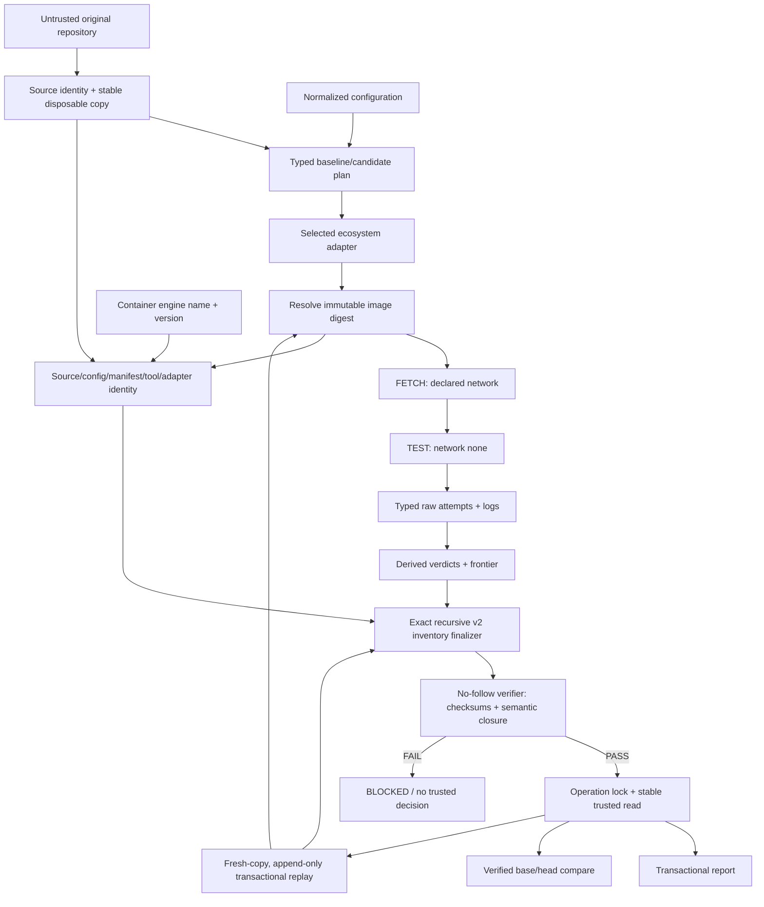
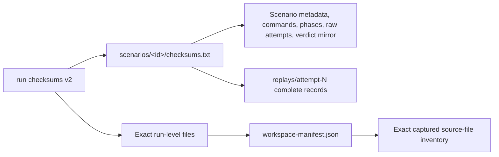
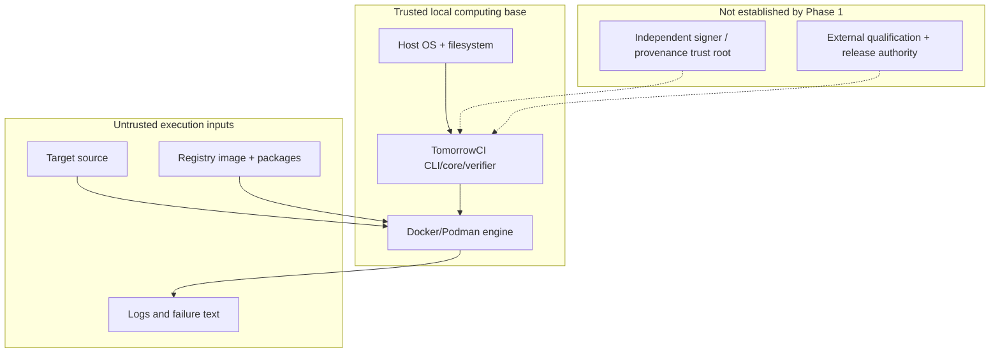

# Architecture diagram: current-v2 trust path

## Evidence binding

The checksum graph detects changes and omissions; it is not a cryptographic signature or external attestation.

## Trust boundaries

Container isolation, registry provenance, and external trust remain residual dependencies. M2 through M5 are not qualified by the current-v2 evidence path.
